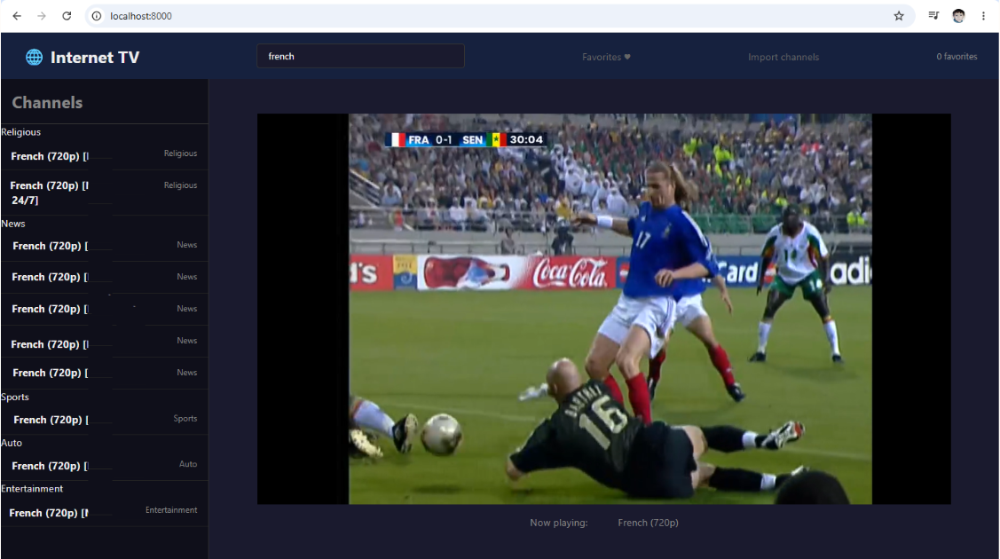

# 🌐 Internet TV — Worldwide Channels


A self-hosted IPTV web player built with Flask and HLS.js. Stream live TV channels from any M3U/M3U8 playlist directly in your browser — no plugins, no subscriptions, no tracking.

> ⚠️ **Please read the [Legal Disclaimer](#️-legal-disclaimer--channel-policy) before use.**

---

## ✨ Features

- 📺 **HLS streaming** via a built-in server-side proxy (bypasses CORS restrictions)
- 📋 **M3U/M3U8 playlist support** — import from file or remote URL
- 🔍 **Live channel search** with instant filtering
- ⭐ **Favorites** — mark and quickly access your preferred channels
- 🗂️ **Group view** — channels organized by category (Movies, News, Sports, …)
- 🔒 **SSRF protection** — upstream URLs are validated before proxying
- 🐳 **Docker-ready** — one command to run anywhere

---

## ⚠️ Legal Disclaimer & Channel Policy

This software is provided for **personal and educational use only**.

The application does **not** include, distribute, or host any TV streams or copyrighted content. It is a **technical tool only** — comparable to a media player like VLC.

### Included demo channels

The sample playlist (`network/channels.m3u8`) contains only **officially free and publicly licensed streams**:

| Channel | Country | License |
|---------|---------|---------|
| Deutsche Welle (DW) | 🇩🇪 Germany | ✅ Explicitly free for redistribution |
| Al Jazeera English | 🌐 International | ✅ Official public livestream |
| France 24 English | 🇫🇷 France | ✅ Official public livestream |
| NASA TV | 🇺🇸 USA | ✅ Public Domain (US Government) |

### User responsibility

Users are **solely responsible** for ensuring that any additional playlist or stream URL they import complies with:

- Applicable **copyright laws** in their country
- The **terms of service** of the respective content providers
- Any applicable **geo-restriction** rules

### This tool is NOT intended for

- ❌ Streaming commercially licensed content (Sky, Netflix, Canal+, BBC, ARD, ZDF, etc.)
- ❌ Circumventing geo-restrictions or DRM protection
- ❌ Any form of commercial IPTV redistribution
- ❌ Public or large-scale deployment with third-party streams

The author assumes **no liability** for misuse of this software.

---

## 🚀 Quick Start

### Option A — Docker (recommended)

```bash
git clone https://github.com/noeljoan/internet-tv.git
cd internet-tv
docker-compose up --build
```

Open **http://localhost:8000** in your browser.

### Option B — Local Python

```bash
git clone https://github.com/noeljoan/internet-tv.git
cd internet-tv
pip install -r requirements.txt
python src/app.py
```

Open **http://localhost:5000** in your browser.

---

## 🖼️ Screenshot



## 📁 Project Structure

```
internet-tv/
├── src/
│   ├── app.py                  # Flask backend & streaming proxy
│   └── ui/
│       ├── templates/
│       │   └── index.html      # Single-page frontend
│       └── static/
│           └── style.css       # Stylesheet
├── network/
│   └── channels.m3u8           # Demo playlist (free/public streams only)
├── favorites.json              # Persisted favorites (auto-created)
├── docker-compose.yml
├── Dockerfile
└── requirements.txt
```

---

## 📡 Adding Channels

Place your channel playlist at `network/channels.m3u8` before starting the app.  
The file must follow the standard M3U8 format:

```m3u
#EXTM3U
#EXTINF:-1 tvg-id="example" tvg-logo="https://logo.url/img.png" group-title="News",Channel Name
https://stream.url/live/stream.m3u8
```

You can also import a remote playlist at runtime using the **Import channels** button in the UI.

> Only add streams that you are legally permitted to access and use.

---

## 🔌 API Reference

| Method | Endpoint | Description |
|--------|----------|-------------|
| `GET` | `/api/channels` | List channels (supports `?page=&size=`) |
| `GET` | `/api/favorites` | Get saved favorites |
| `POST` | `/api/favorites` | Add a channel to favorites |
| `DELETE` | `/api/favorites` | Remove a channel from favorites |
| `POST` | `/api/import` | Upload an M3U8 file |
| `POST` | `/api/import_url` | Import playlist from remote URL |
| `GET` | `/api/stream?url=` | Proxy and rewrite an HLS stream |

---

## ⚙️ Configuration

Environment variables (set in `docker-compose.yml` or your shell):

| Variable | Default | Description |
|----------|---------|-------------|
| `LOG_LEVEL` | `INFO` | Logging verbosity (`DEBUG`, `INFO`, `WARNING`) |
| `FLASK_ENV` | `production` | Flask environment |

---

## 🛡️ Security Notes

- All upstream stream URLs are validated against a blocklist of private/loopback/reserved IP ranges before proxying (SSRF guard).
- Only `http` and `https` schemes are allowed.
- No user data is collected or sent to third parties.

---

## 🧰 Tech Stack

| Layer | Technology |
|-------|-----------|
| Backend | Python 3.12 · Flask 2.3 · Requests |
| Frontend | Vanilla JS · HLS.js · Axios |
| Proxy | Flask `stream_with_context` · M3U8 URI rewriting |
| Container | Docker · Docker Compose |

---

## 📋 Requirements

- Python 3.10+ (or Docker)
- A valid M3U/M3U8 playlist file with **legally accessible** stream URLs

---

## 🤝 Contributing

Pull requests are welcome. For major changes, please open an issue first.

1. Fork the repository
2. Create a feature branch (`git checkout -b feature/my-feature`)
3. Commit your changes (`git commit -m 'Add my feature'`)
4. Push to the branch (`git push origin feature/my-feature`)
5. Open a Pull Request

Please ensure any contributed channel lists contain **only publicly licensed, freely available streams**.

---

## 📄 License

This project is licensed under the [MIT License](LICENSE).

The MIT License covers the **software code only**. It does not grant any rights to stream, reproduce, or redistribute third-party broadcast content. Users are responsible for complying with all applicable laws and content licenses.

---

> Built with ❤️ by [Noel Joan](https://github.com/noeljoan)
